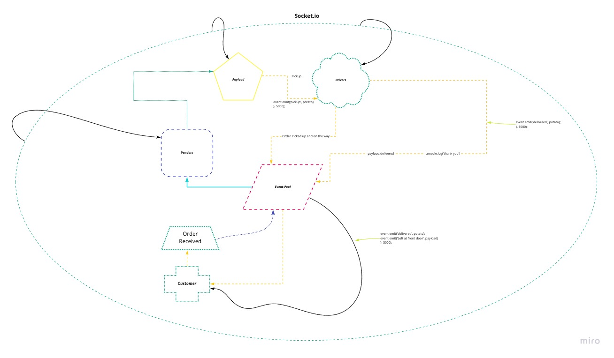

# Lab 12.3.0 - 401 JavaScript

## CAPS: Code Academy Parcel Service

## Author: Jason Taisey

## Links and Resources

- [Github](https://github.com/JTaisey389/CAPS)
- [Pull-Requests](https://github.com/JTaisey389/CAPS/pulls)

### User Stories

The following user/developer stories detail the major functionality for this phase of the project.

- As a vendor, I want to alert the system when I have a package to be picked up
- As a driver, I want to be notified when there is a package to be delivered
- As a driver, I want to alert the system when I have picked up a package and it is in transit
- As a driver, I want to alert the system when a package has been delivered
- As a vendor, I want to be notified when my package has been delivered
- And as developers, here are some of the development stories that are relevant to the above

- As a developer, I want to use industry standards for managing the state of each package
- As a developer, I want to create an event driven system so that I can write code that happens in response to events, in real time

### User Stories Part Three

Here are the high level stories related to this new set of requirements

- As a vendor, I want to “subscribe” to “delivered” notifications so that I know when my packages are delivered
- As a vendor, I want to “catch up” on any “delivered” notifications that I might have missed so that I can see a complete log
- As a driver, I want to “subscribe” to “pickup” notifications so that I know what packages to deliver
- As a driver, I want to “catch up” on any “pickup” notifications I may have missed so that I can deliver everything
- As a driver, I want a way to “scan” a delivery so that the vendors know when a package has been delivered
And as developers, here are some of the development stories that are newly relevant to the above

- As a developer, I want to create a system of tracking who is subscribing to each event
- As a developer, I want to place all inbound messages into a “queue” so that my application knows what events are to be delivered
- As a developer, I want to create a system for communicating when events have been delivered and received by subscribers
- As a developer, I want to delete messages from the queue after they’ve been received by a subscriber, so that I don’t re-send them

- As a developer, I want to create a system for allowing subscribers to retrieve all undelivered messages in their queue

### UML

